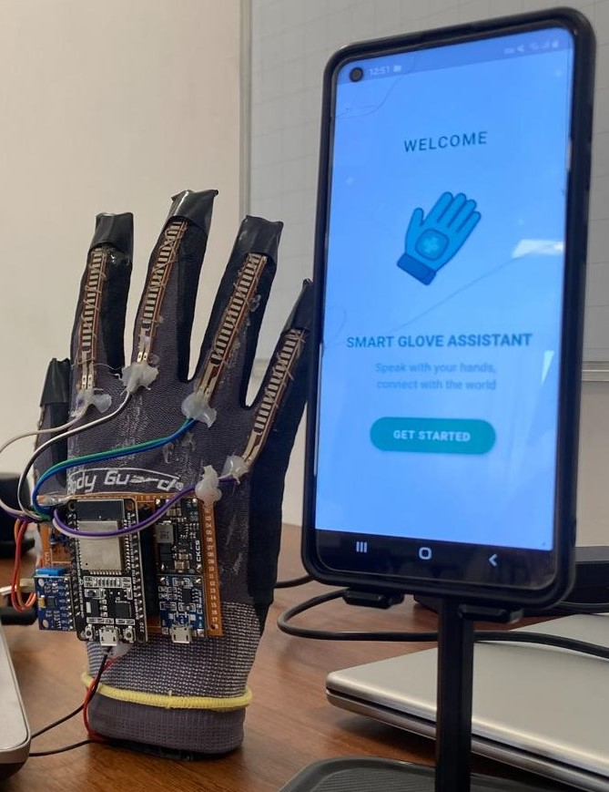
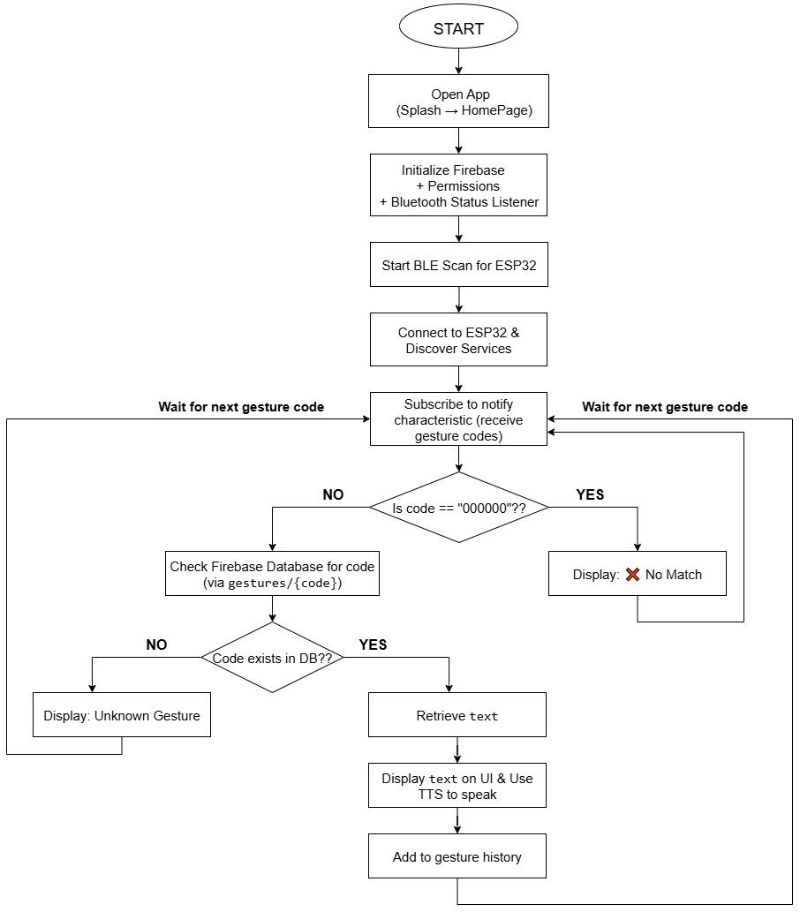
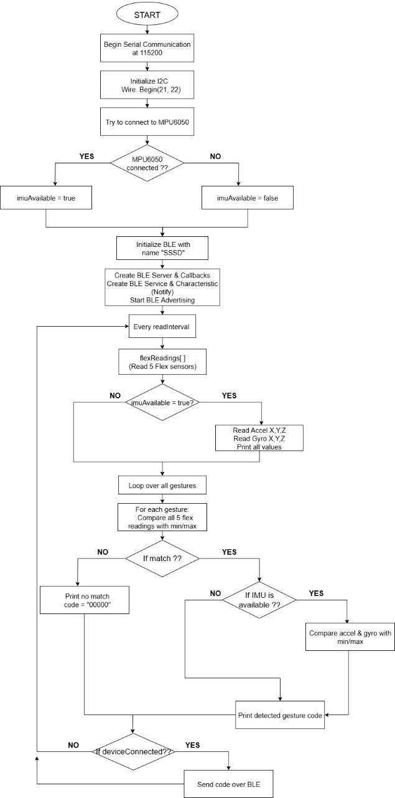
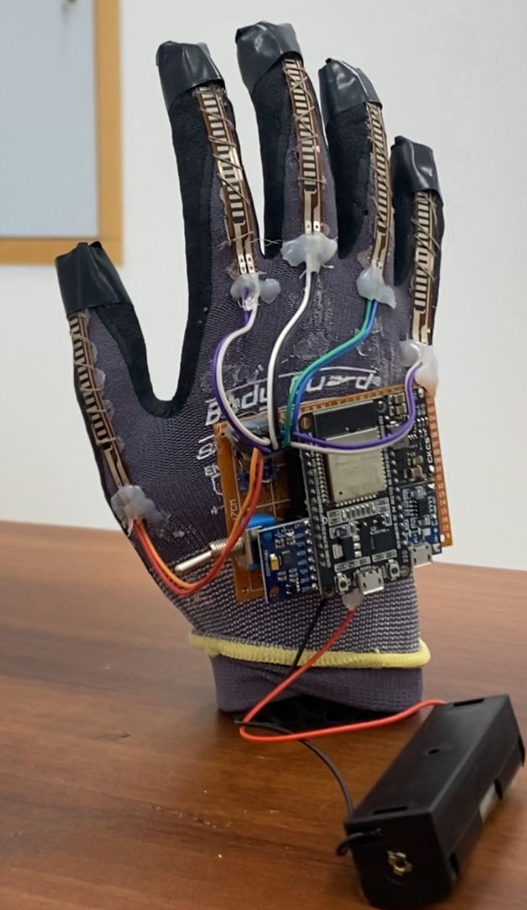
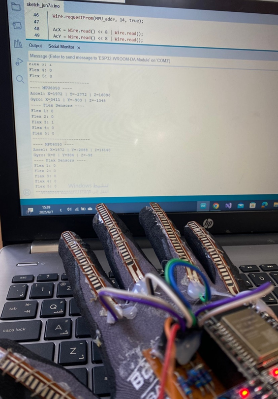
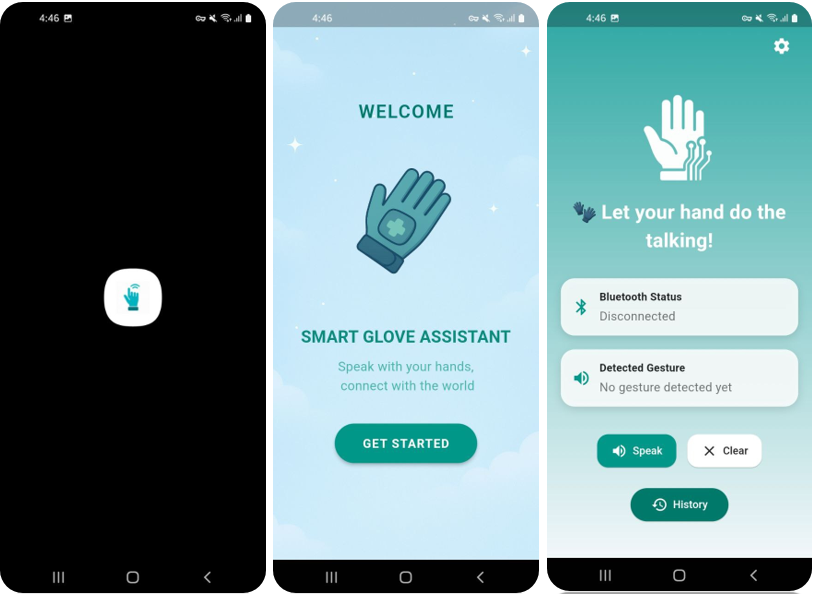
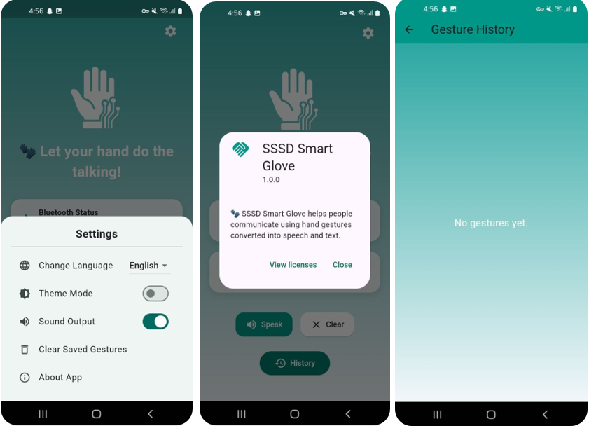
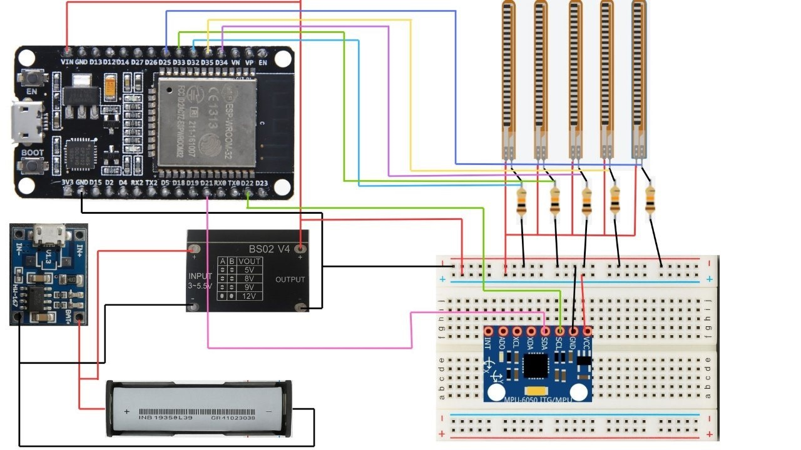
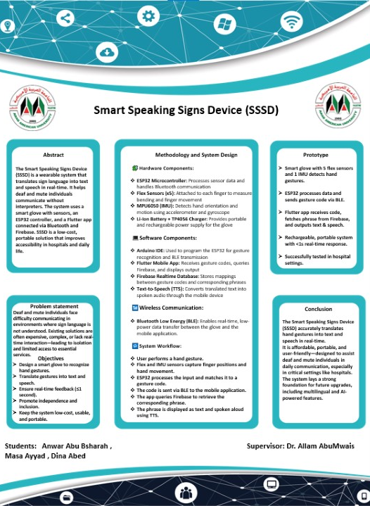

# 🧤 Smart Speaking Signs Device

<p align="center">
  
</p>

<h3 align="center">
Real-Time Sign Language to Speech & Text Conversion
</h3>

---

## 📌 Project Overview

The **Smart Speaking Signs Device** is an intelligent wearable glove designed to translate sign language into **readable text and audible speech in real time**, helping deaf and mute individuals communicate more effectively, especially in healthcare environments.

This graduation project was developed to bridge communication barriers between deaf and mute individuals and society through smart assistive technology.

The glove captures finger movements and hand orientation using **Flex Sensors** and **MPU6050**, processes gestures using **ESP32**, and transmits data wirelessly via **Bluetooth Low Energy (BLE)** to a Flutter mobile application.

The mobile application then:

* 📝 Displays the recognized sign as text
* 🔊 Converts text into speech using **Text-to-Speech (TTS)**

The project was developed with a focus on:

* ⚡ Real-time communication
* 💰 Low-cost implementation
* 🧤 Ease of use
* ♿ Accessibility support
* 🏥 Healthcare environments

---

## ✨ Features

* ⚡ Real-time sign language recognition
* 🔊 Instant speech output using Text-to-Speech (TTS)
* 📝 Real-time text display through mobile application
* 📡 Wireless communication using Bluetooth Low Energy (BLE)
* 🧤 Lightweight and wearable smart glove design
* 📱 User-friendly Flutter mobile application
* 🏥 Support for healthcare communication scenarios
* 💡 Low-cost assistive technology solution

---

## ⚙️ Technologies Used

### 🔌 Hardware

* ESP32
* Flex Sensors (x5)
* MPU6050 Motion Sensor
* Bluetooth Low Energy (BLE)

### 💻 Software

* Flutter
* Firebase
* Arduino IDE (ESP32 Programming)
* C++ (ESP32 Programming)
* Text-to-Speech (TTS)

---

## 🔧 Hardware & Software Components

| Component    | Purpose                                  |
| ------------ | ---------------------------------------- |
| ESP32        | Main microcontroller for processing data |
| Flex Sensors | Detect finger bending movements          |
| MPU6050      | Detect hand motion and orientation       |
| BLE          | Wireless communication                   |
| Flutter App  | Display translated text and speech       |
| Firebase     | Store and manage data                    |
| TTS          | Convert text into voice                  |

---

## 🧠 How the System Works

The system works through the following process:

1. The user performs a hand gesture using the smart glove.
2. Flex Sensors detect finger bending movements.
3. MPU6050 detects hand motion and orientation.
4. ESP32 processes sensor readings and identifies gestures.
5. The recognized sign is transmitted wirelessly via BLE.
6. The Flutter mobile application receives the data.
7. The gesture is displayed as readable text.
8. Text-to-Speech converts the text into audible speech.

---

## 📊 System Workflow

```text
Sign Language Gesture
        ↓
Flex Sensors + MPU6050
        ↓
ESP32 Processing
        ↓
Bluetooth Low Energy (BLE)
        ↓
Flutter Mobile Application
        ↓
Text Display + Speech Output
```

### 📈 Flowcharts

#### Mobile Application Flowchart

<p align="center">
  
</p>

#### ESP32 Microcontroller Flowchart

<p align="center">
  
</p>

---

## 🏗 System Architecture

The system consists of three main layers:

### 1️⃣ Hardware Layer

Responsible for gesture sensing and motion detection using:

* Flex Sensors
* MPU6050
* ESP32

### 2️⃣ Communication Layer

Responsible for real-time wireless data transmission using:

* Bluetooth Low Energy (BLE)

### 3️⃣ Application Layer

Responsible for:

* Displaying translated text
* Generating speech output
* Managing communication through Flutter & Firebase

---

## 📊 Project Results

* ✅ Successfully implemented **40+ hand gestures**
* ✅ Achieved approximately **87% recognition accuracy**
* ✅ Real-time speech and text conversion
* ✅ Successfully tested in healthcare communication scenarios

---

## 🌍 Media Recognition

The project received significant public recognition due to its **social impact** and innovative contribution to assistive technology.

It was featured across:

* 📱 Social media platforms
* 📺 TV channels
* 🎙 Radio stations
* 📰 News interviews
* 🎓 University exhibitions and events

The project gained attention for improving communication accessibility for deaf and mute individuals.

---

# 📸 Project Gallery

<h3 align="center">🧤 Smart Glove</h3>

<p align="center">
  
  
  
</p>

---

<h3 align="center">📱 Mobile Application</h3>

<p align="center">
  
  
</p>

---

<h3 align="center">🔧 Hardware Components</h3>

<p align="center">
  
</p>

---

<h3 align="center">📌 Project Poster</h3>

<p align="center">
  
</p>

<p align="center">
  📄 <a href="Poster/POSTER_SSSD.pdf">
  Download Project Poster
  </a>
</p>

---

## 🎥 Demo Video

<p align="center">
  
</p>

<p align="center">
  Watch the Smart Speaking Signs Device demonstration video:
</p>

<p align="center">
  <a href="https://drive.google.com/file/d/1fMt22c8ajauHyEJ4nHGmc-IGWgudZfpw/view">
    
  </a>
</p>

---


## ⚠️ Challenges Faced

During development, several challenges were encountered:

* Sensor calibration accuracy
* Gesture recognition consistency
* Real-time BLE communication reliability
* Hardware integration and optimization

These challenges were solved through testing, calibration, and iterative improvements.

---

## 🚀 Future Improvements

Potential future enhancements include:

* 🤖 Artificial Intelligence (AI) for smarter gesture recognition
* 🧤 Support for more sign language gestures
* 🌍 Multi-language support
* ☁️ Cloud synchronization
* 📈 Higher recognition accuracy
* 🏥 Integration with healthcare systems

---

## 📂 Repository Structure

```text
Smart-Speaking-Signs-Device
│── Embedded_System
│── Flutter_App
│── Documentation
│── Images
│── Poster
│── System_Flowchart
│── Media_Coverage
│── README.md
```

---

## 👩‍💻 Author

<p align="center">

### **Anwar Bshara**

**Computer Systems Engineer**

📧Email:
anwarbshara2002@gmail.com

💼 LinkedIn:
https://www.linkedin.com/in/anwaar-bshara

💻 GitHub:
https://github.com/anwarbshara

</p>

